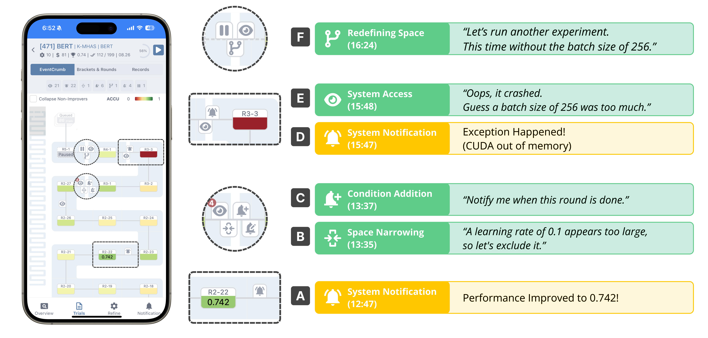
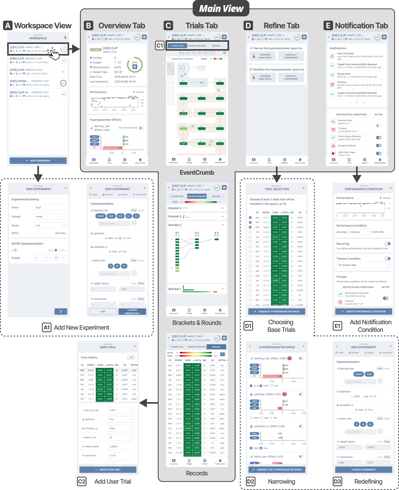
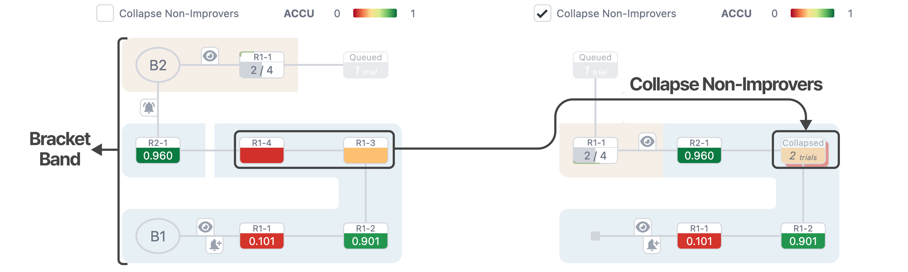

# 📱 HyPockeTuner

[](https://doi.org/10.1145/3772318.3790977)
[](https://idclab.skku.edu/HyPockeTuner-demo/)
[](LICENSE)
[](https://python.org)
[](https://react.dev)

**Bringing Hyperparameter Optimization to Mobile Devices**

A mobile system for **monitoring**, **steering**, and **reflecting** on HPO experiments from smartphones.



HyPockeTuner supports long-running HPO experiments with a **notification-driven workflow**: **Configure → Optimize → Analyze → Refine**.



---

## ✨ Key Features

- **EventCrumb Visualization**
  - A mobile-optimized event sequence visualization for tracking experiment history.
  - Shows completed trials with performance metrics, bracket progression, and user intervention points.

- **Notification-Driven Workflow**
  - Subscribe to events: performance improvements, round completion, exceptions.
  - Get notified instead of constant monitoring.

- **Interactive Refinement Operations**
  - **Narrow** the search space while preserving learned weights.
  - **Redefine** the space to launch independent experiments with adjusted configurations.
  - Inject **User Trials** to test hypotheses directly in the optimization loop.



---

## 🔧 Supported Kernels

| Kernel              | Dataset       | Task                 | Key Hyperparameters                               |
| :------------------ | :------------ | :------------------- | :------------------------------------------------ |
| **MNIST**           | MNIST         | Image Classification | `lr`, `batch_size`, `optimizer`, `hidden_dim`     |
| **CIFAR-10**        | CIFAR-10      | Image Classification | `lr`, `architecture`, `dropout`, `weight_decay`   |
| **NLP**             | GLUE / K-MHaS | Text Classification  | `lr`, `warmup_steps`, `model_type`, `max_seq_len` |
| **Vision-Language** | MS-COCO       | Image-Text Retrieval | `lr`, `batch_size`, `encoder`, `embedding_dim`    |

---

## 🔌 Add Your Own Kernel

Integrate your model training code via the Python API to use with the BOHB optimizer.

See `server/kernels/` for template examples.

---

## ⚡ Quick Start

### Backend

```bash
# 1. Navigate to server
cd server

# 2. Install dependencies
pip install -r requirements.txt

# 3. Run the API server (Terminal 1)
python main.py --host 0.0.0.0 --port 8080

# 4. Run the worker process (Terminal 2)
python worker.py
```

> **Note**: Both `main.py` (API server) and `worker.py` (trial executor) must be running simultaneously.

### Frontend

```bash
# 1. Navigate to client
cd client

# 2. Install dependencies
npm install

# 3. Launch the UI
npm run dev
```

---

## ⚙️ Configuration

### Push Notifications Setup

To enable push notifications on your smartphone:

**1. Generate VAPID Keys**

```bash
npx web-push generate-vapid-keys
```

This will output:
```
Public Key: BEl62iUYgU...
Private Key: UUxI4oKwbA...
```

**2. Configure Server**

```bash
# server/.env
VAPID_PUBLIC_KEY=BEl62iUYgU...      # Public key from step 1
VAPID_PRIVATE_KEY=UUxI4oKwbA...     # Private key from step 1
VAPID_CLAIMS_EMAIL=your@email.com
```

**3. Configure Client**

```bash
# client/.env.local
VITE_VAPID_PUBLIC_KEY=BEl62iUYgU... # Same public key from step 1
```

> **Note**: Push notifications require HTTPS in production. For local development, notifications are simulated on `localhost`.

### BOHB Parameters

Configure the optimization in experiment settings:

| Parameter | Description                            | Example |
| :-------- | :------------------------------------- | :------ |
| `η` (eta) | Dividing factor for successive halving | 3       |
| `b_min`   | Minimum budget (epochs)                | 1       |
| `b_max`   | Maximum budget (epochs)                | 81      |

### Notification Conditions

| Type            | Description                                             |
| :-------------- | :------------------------------------------------------ |
| **Progress**    | Alert when brackets or rounds are complete                  |
| **Performance** | Alert when accuracy reaches target or improves by Δ     |
| **Timeout**     | Alert when no improvement within time window            |
| **Emergency**   | Alert for high GPU temp, low utilization, or exceptions |

---

## 📊 System Architecture

```
┌──────────────────┐     Socket.IO     ┌──────────────────┐
│  React Frontend  │◄─────────────────►│  FastAPI Backend │
│                  │                   │                  │
│  • EventCrumb    │                   │  • BOHB Engine   │
│  • Zustand Store │                   │  • ML Kernels    │
│  • Push Notif.   │                   │  • GPU Monitor   │
└──────────────────┘                   └──────────────────┘
```

---

## 🔗 Related Resources

- **BOHB Paper** → [Robust and Efficient Hyperparameter Optimization at Scale](https://arxiv.org/abs/1807.01774)
- **ATMSeer** → [Increasing Transparency and Controllability in AutoML](https://doi.org/10.1145/3290605.3300911)
- **HyperTendril** → [User-driven Hyperparameter Optimization](https://doi.org/10.1109/TVCG.2020.3030380)

---

## 📚 Citation

TBU

---

## 👥 Authors

| Name             | Affiliation               | Email              |
| :--------------- | :------------------------ | :----------------- |
| **Donghee Hong** | Sungkyunkwan University   | dh.hong@skku.edu   |
| **Bongshin Lee** | Yonsei University         | b.lee@yonsei.ac.kr |
| **Jinwook Seo**  | Seoul National University | jseo@snu.ac.kr     |
| **Jaemin Jo\***  | Sungkyunkwan University   | jmjo@skku.edu      |

_\* Corresponding author_

---

## 🙏 Acknowledgments

This work was supported by:

- National Research Foundation of Korea (NRF) - RS-2025-24873100, RS-2023-NR077081
- Institute of Information and Communications Technology Planning and Evaluation (IITP) - AI Graduate School Program at SKKU, Yonsei, and SNU

---
